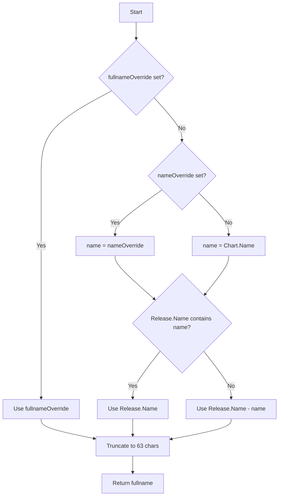

# AIM Deployment Helm Chart

This Helm chart provides a parameterized way to deploy AIMs on Kubernetes. It converts the static Kubernetes deployment
into a flexible, configurable template that can be customized for different models.

## Structure

```
sample-minimal-aims-helm-deployment/
├── Chart.yaml                             # Chart metadata
├── values.yaml                            # Default configuration values
├── templates/
│   ├── deployment.yaml                    # Parameterized deployment template
│   ├── service.yaml                       # Service template
│   └── _helpers.tpl                       # Template helpers for naming/labeling
├── overrides/
│   └── aim-meta-llama-llama-3-1-8b-instruct.yaml  # Sample override file for a specific model
│   ...
└── README.md                              # This file
```

## Deployment

### 1. (Optional) Create secret for gated models

**Note:** Only required if deploying gated models that need Hugging Face authentication.

AIM uses Docker Hub container registry to host its images. The images are public and no authentication is required to pull.
However, some models are gated and require authentication to download them from Hugging Face.

If using a gated model, create a Kubernetes secret for Hugging Face token to download models:

```bash
kubectl create secret generic hf-token \
    --from-literal="hf-token=YOUR_HUGGINGFACE_TOKEN" \
    -n YOUR_K8S_NAMESPACE
```

Expected output:

```
secret/hf-token created
```

### 2. Install AMD device plugin if it is not already in place

Fetch plugin manifest and create the DaemonSet:

```bash
kubectl create -f https://raw.githubusercontent.com/ROCm/k8s-device-plugin/master/k8s-ds-amdgpu-dp.yaml
```

Expected output:

```
daemonset.apps/amdgpu-device-plugin-daemonset created
```

### 3. Deploy Helm Chart

Create default deployment

```bash
# Install with default values
helm template aim-default . | kubectl apply -n YOUR_K8S_NAMESPACE -f -
```

Expected output:

```
service/aim-default-minimal-aim-app created
deployment.apps/aim-default-minimal-aim-app created
```

Create default deployment using existing model override files

```bash
helm template aim-meta-llama-3-1-8b . \
  -f ./overrides/aim-meta-llama-llama-3-1-8b-instruct.yaml \
  | kubectl apply -n YOUR_K8S_NAMESPACE -f -
```

Expected output:

```
service/aim-meta-llama-3-1-8b-minimal-aim-app created
deployment.apps/aim-meta-llama-3-1-8b-minimal-aim-app created
```

#### Naming convention in the examples

Names in the example are set with default `_helper.tpl` generated by `helm create` command.

| Field                                 | Variable name           | Value                                                                                          | Purpose                                                      |
|---------------------------------------|-------------------------|------------------------------------------------------------------------------------------------|--------------------------------------------------------------|
| metadata.name                         | aim.fullname            | .Values.fullnameOverride -> .Values.nameOverride -> .Chart.Name -> .Release.Name[-.Chart.Name] | The deployment's name in the cluster                         |
| metadata.labels                       | aim.labels, ...         | .Chart.Name-.Chart.Version, ...                                                                | The deployment's label for organizing and selecting purposes |
| spec.selector.matchLabels             | aim.selectorLabels, ... | .Chart.Name -> .Values.nameOverride, ...                                                       | Label selector to find pods                                  |
| spec.template.metadata.labels         | aim.selectorLabels, ... | .Chart.Name -> .Values.nameOverride, ...                                                       | Pod label for identification                                 |
| spec.template.spec.containers[0].name | .Chart.Name             | .Chart.Name                                                                                    | Container name within the pod                                |

Flowchart illustrating the name resolution for `metadata.name`:



## Testing

### 1. Port forward the service to access it locally

Do port forwarding

```bash
kubectl port-forward service/aim-meta-llama-3-1-8b-minimal-aim-app 8000:8000 -n YOUR_K8S_NAMESPACE
```

Expected output:

```
Forwarding from 127.0.0.1:8000 -> 8000
Forwarding from [::1]:8000 -> 8000
```

### 2. Test the inference endpoint

Make a request to the inference endpoint using `curl`:

```bash
curl http://localhost:8000/v1/completions \
    -H "Content-Type: application/json" \
    -d '{
        "model": "meta-llama/Llama-3.1-8B-Instruct",
        "prompt": "San Francisco is a",
        "max_tokens": 7,
        "temperature": 0
    }'
```

Expected output:

```json
{
  "id": "cmpl-703ff7b124a944849d64d063720a28f4",
  "object": "text_completion",
  "created":1758657978,
  "model":"meta-llama/Llama-3.1-8B-Instruct",
  "choices": [
    {
      "index": 0,
      "text":" city that is known for its v",
      "logprobs": null,
      "finish_reason":"length",
      "stop_reason":null,
      "prompt_logprobs":null,
    }
  ],
  "usage": {
    "prompt_tokens": 5,
    "total_tokens": 12,
    "completion_tokens": 7,
    "prompt_tokens_details": null,
  },
  "kv_transfer_params": null
}
```

## Removing the deployment

To remove the deployment and service, run:

```bash
helm template aim-meta-llama-3-1-8b . \                                            
  -f ./overrides/aim-meta-llama-llama-3-1-8b-instruct.yaml \
  | kubectl delete -n YOUR_K8S_NAMESPACE -f -
```

Expected output:

```
service "aim-meta-llama-3-1-8b-minimal-aim-app" deleted
deployment.apps "aim-meta-llama-3-1-8b-minimal-aim-app" deleted
```
